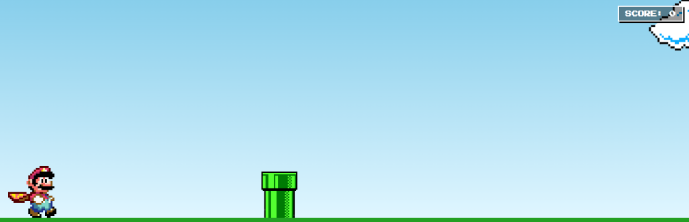

# Mario Jump Game (8-Bit Arcade)

Acesse o game: https://guilhermeh4sh.github.io/jogo-do-mario/

Um jogo de corrida infinita retrô inspirado no clássico **Super Mario Bros**, desenvolvido com **HTML5, CSS3 e JavaScript**.



## 🎮 Como Jogar

1. Acesse o jogo abrindo o arquivo `index.html` em qualquer navegador.
2. Pressione qualquer tecla no teclado (como `Barra de Espaço` ou `Seta para Cima`) para fazer o Mario pular sobre o tubo.
3. A cada tubo superado com sucesso, você ganha **+1 ponto**.
4. Se o Mario colidir com o tubo, a tela de **Game Over** será exibida com o botão **RESTART** para tentar novamente.

## 🛠️ Tecnologias Utilizadas

* **HTML5**: Estruturação dos elementos do jogo.
* **CSS3**: Estilização retrô, fontes pixeladas (`Press Start 2P`) e animações.
* **JavaScript**: Lógica de pulo, detecção de colisão em tempo real e controle de pontuação.

## 🚀 Como Executar o Projeto

1. Clone o repositório:
   ```bash
   git clone https://github.com/guilhermeH4sh/jogo-do-mario.git
   ```
2. Entre na pasta do projeto:
   ```bash
   cd jogo-do-mario
   ```
3. Abra o arquivo `index.html` em qualquer navegador web (ou use a extensão **Live Server** no VS Code).

---
Desenvolvido por [Guilherme](https://github.com/guilhermeH4sh).
